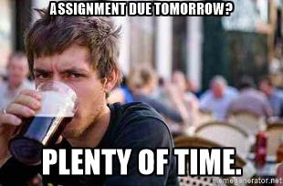

+++
date = "2017-06-16T13:19:37+02:00"
description = "Dokumentacija, napotki in možni popravki o vodenju organizacije javne prireditve."
title = "Organizacija koncerta: to in ono"

+++

Pred kratkim sem bil deležen časti, da sodelujem pri organizaciji sorazmerno obsežne javne prireditve. Šlo je za koncert reda približno 800 glav, če štejemo tako nastopajoče kot tudi obiskovalce. Moja vloga? Kot podpredsednik glasbenega društva sem se veselil, da bom lahko opazoval postopek ter se kaj novega naučil.  
Potem pa je predsednica odšla v tujino. In v rokah so se mi znašle vajeti kočije, ki ji je zaenkrat manjkalo še cel kup delov, med drugim koles.  

Znašel sem se pred dvemi vprašanji. Kje sploh začeti z organizacijo take prireditve ter kakšna je sploh moja vloga, glede na to da je prireditev sama po sebi dirigentova intelektualna lastnina. 

Šlo je za koncert na odprtem, z nastopajočim simfoničnim orkestrom ter tremi pevskimi zbori. Predvideno število obiskovalcev je bilo 650. Naše mlado društvo ni organiziralo še ničesar podobnih razsežnosti. Predsednica me je opozorila, da bi bilo dobro preučiti uradne zahtevke, ki se tičejo organizacije prireditve kot je ta. Prve poizvedbe preko interneta so mi pustile cmok v grlu. Poplava informacij ter zahtev o zagotavljanju varnosti gostov, pravočasnih prijavah na policiji, uradni enoti, občini in tako dalje. Same po sebi nadležno banalne naloge, ki pa te lahko poplavijo s svojo številčnostjo. 

Ena stvar mi je bila že takoj jasna. Vedeti moram, kaj prodajam.  
Nisem imel pojma, kaj prodajam. Nekaj v zvezi z muzikali, z izvedbo na grajskem dvorišču. Baje bo prijetno. Vsekakor premalo za kakršen koli uradni dokument.  

Nahajamo se dobre 4 mesece pred izvedbo koncerta. Jaz sem začel raziskovati uradno plat dogodka, dirigent pa se je šel dogovarjat za prostor ter oder. Imeli smo začetni sestanek ter postavili datum. Za točno uro naslov in temo smo se strinjali, da je časa še čez glavo. 

